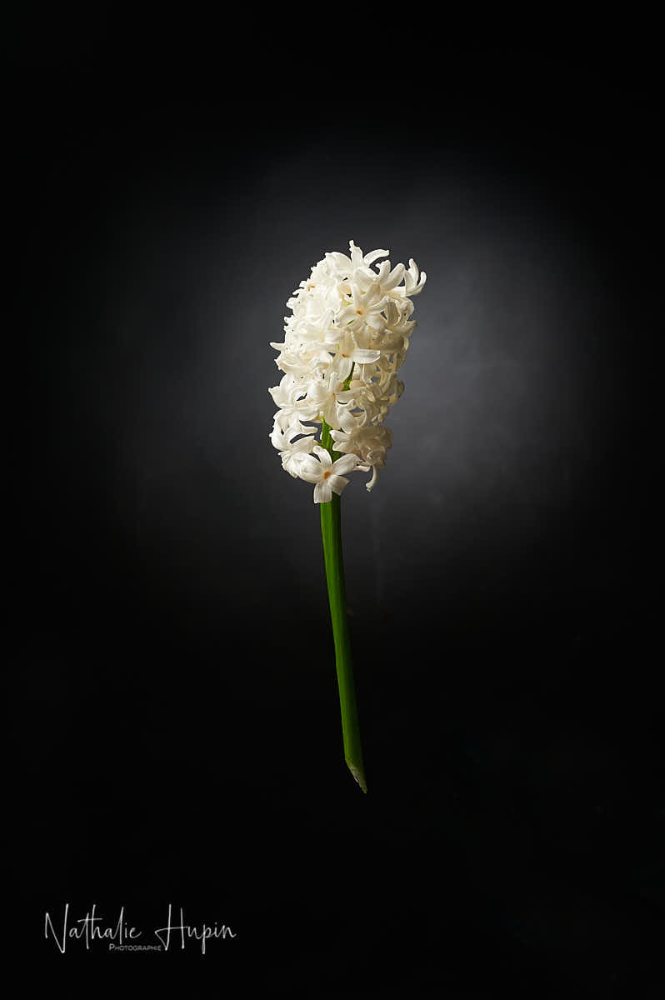

## Bonjour à tous,

« Je suis infirmière en maison de repos et aujourd’hui je suis victime du Covid 19 je suis donc de l’ autre côté de la barrière (pas le soignant mais le soigné).
Je voulais par ce témoignage vous conscientiser que cela arrive sans qu’on s y attende, je disais comme la plupart des gens “bah c est une grippe”.

Ben non ça vous mets kao,oui j ai beaucoup de mal à respirer( alors que en temps normal j ai aucun problème)mais si y n y avait que ça!juste se lever pour aller au toilette demande un effort sur humain tellement je suis épuisée, mon appétit et parti j ai perdu 3kg en 8jours, je me retrouve sous le même toit que mon fils sans aucun contact possible, toutes ces choses que l'on fait quotidiennement sans réfléchir ben soit j y arrive pas soit j en suis privée.

Ajourd’hui malgré tout je reste positive car je vais vaincre ce virus mais pour ça j ai besoin de vous SVP respectez les consignes de confinements ensemble ont peux y arriver à stopper cette épidémie.
C est bien de remercier le Corp médical pour leur courage mais on pourrait plutôt les aider à ce qu il y est moins voir plus de cas.

Merci ❤ »

_Ce 20 mars 2020, j’ai choisi de photographier une jacinthe blanche. C’était une jacinthe que j’avais reçue dans une jardinière et que j’ai replantée en pleine terre, une fois fânée. Elle se démultiplie chaque année et répand son parfum envoûtant partout où elle se trouve.
— photographie par **Nathalie Hupin**_

> « Je vais peut-être tomber malade. »

Le témoignage que vous avez lu ci-dessus, c’est celui de Maria, une des participantes à la formation photo qui commençait ce lundi 9 mars. Elle m’a annoncé qu’elle ne pourrait pas participer au cours du 23 mars, car elle était malade. Et je lui ai demandé de me tenir informée de son état de santé. Le verdict est tombé hier : Maria est positive au covid-19. Ce qui veut dire que tous ceux qui étaient à la formation peuvent avoir été infectés, malgré qu’on a été prudents, vu ce qui se racontait déjà sur la pandémie. Même si personne n’était malade, on ne s’est pas fait la bise, on a respecté les distances d’1 mètre. Mais maintenant, pendant la période critique, on se demande tous les trois si c’était bien suffisant. On sera fixés le 29 mars, puisque la période d’incubation peut aller jusque 20 jours, avec une moyenne de 5. Pour l’instant, aucun de nous ne présentons de symptômes et notre température est normale (on la vérifie deux fois par jour).

Et de la fenêtre du bureau de post-prod où on est confinés, on voit passer des promeneurs sur la place : des gens qui sortent leur chien, leurs enfants, trois générations (grand-mère, enfants/parents, enfant à vélo, et le chien) ou encore des embouteillages aux bulles à verre (jusqu’à trois voitures en même temps), comme si on n’avait que ça à faire, en ce moment, de se débarrasser de tous ses verres.

> En Belgique, aujourd’hui, ce matin, on en était à plus de 30 décès.
