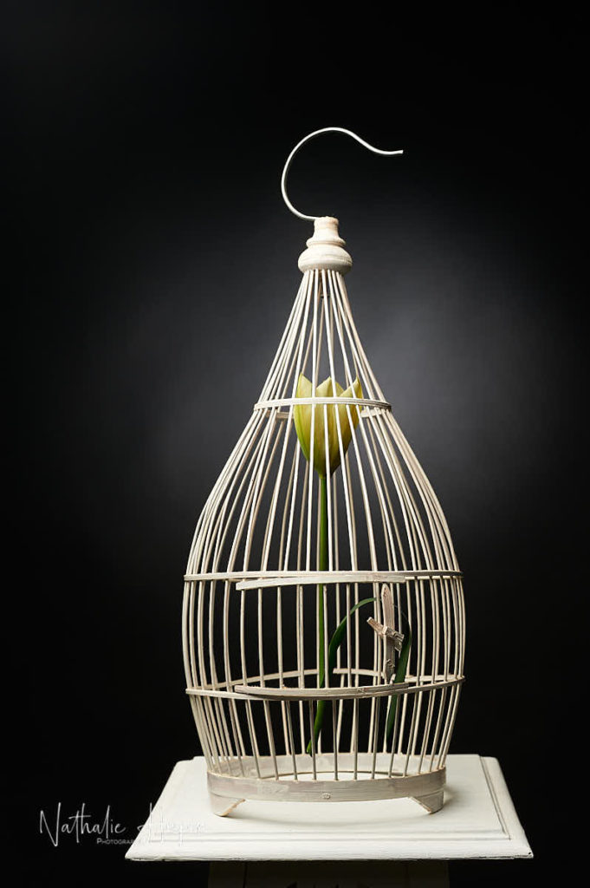
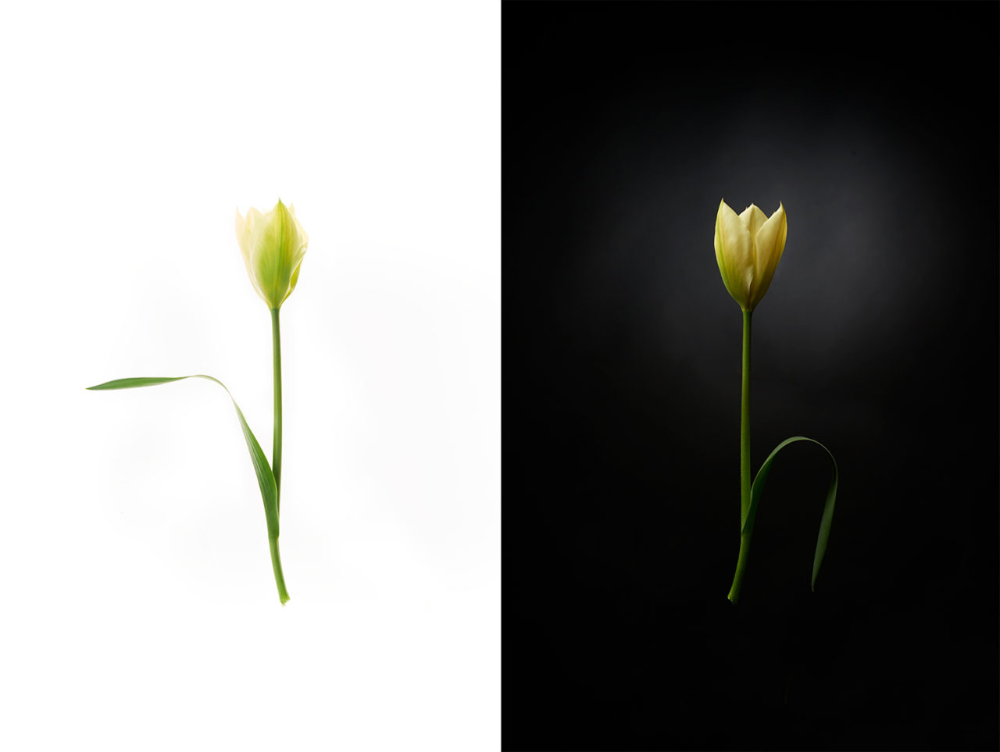

Même si nous nous y préparions, l’annonce d’un confinement pour contrer Corona est tombée comme un couperet auprès de la population belge. Bons vivants chaleureux et amicaux, les Belges ont vu avec effroi la réduction de leur liberté personnelle, même s’il en allait de la survie du collectif. Pour ma part, le confinement ne me pèse pas trop, sauf que mes activités professionnelles sont mises en stand-by pour une durée indéterminée. En effet, sans prise de vue, pas de photos. La plupart de mes sujets étant des personnes à qui je dois expliquer comment se positionner, voire parfois ajuster les vêtements, il est impossible de respecter les consignes de sécurité pour que ça soit sans danger pour chacun.
Paradoxalement, à l’extérieur, les végétaux sortent de leur hibernation et cette renaissance annuelle est plus belle qu’elle ne l’a jamais été. Voilà pourquoi m’est venue l’idée d’une juxtaposition de ces deux situations contradictoires, qui sont, peut-être, révélatrices de la place de l’être humain dans la nature.
J’ai appelé cette réflexion visuelle Divoc, pas la peine de vous expliquer pourquoi.

_Le confinement a commencé officiellement le mercredi 18 mars à 12 heures. Nous voilà enfermés. — photographie par **Nathalie Hupin**_

> “Quand l’être humain est forcé de ralentir ses activités, la nature reprend de l’air”

La nature, cette année, ne m’a jamais semblé aussi belle. Voilà quelques années maintenant (depuis 2013) que j’observe fin mars début avril, l’évolution des plantes que j’ai patiemment semées ou enracinées. Chaque année, la plupart d’entre elles me semblent plus belles, plus vivaces, plus nombreuses.

A côté de ça, un être minuscule (microscopique) est en train de faire peser une menace sur l’espèce humaine. Les obligeant, pour éviter de tomber malades, à rester chez eux et à réduire leurs activités. Des activités qui, parfois détruisent la nature et les végétaux. Qui sait que cet être a priori malfaisant va faire passer un message ? Message qui avait été lancé par des humains conscients de ce qui était en train de se modifier, mais que les autres n’ont pas écouté.

En Belgique, nous voilà obligés de rester dans note habitation et de restreindre nos déplacements au strict minimum depuis le mercredi 18 mars à 12 heures.

_En tant que photographe social, pour la sécurité de chacun, on ne peut plus photographier de personnes. Pendant que les humains sont enfermés, la nature revit, comme chaque année à cette époque. — photographie par **Nathalie Hupin**_

Il y a de plus en plus de fleurs au jardin, elles sont quasi toutes en avance si on compare aux autres années. Leur croissance, et leur évolution va accompagner notre confinement jusqu’à notre libération.

> Pour la photo inaugurale de cette série, j’ai demandé à mes contacts facebook de choisir la version qui leur plaisait le mieux et c’est l’atmosphère plus sombre qui l’a “emporté”. Comme c’est la première photo, je garderai les deux versions, comme il m’a été conseillé par plusieurs d’entre eux.

Je vous invite donc à me retrouver tous les jours ici, après 19 heures, pour ce journal de bord un peu spécial. Mon intention est de vous apporter de l’espoir avec ce que la nature fait de mieux. Pour oublier peut-être qu’elle aussi est capable du pire. Mais que c’est elle qui est la plus solide, malgré ce que nous lui faisons endurer parfois.
