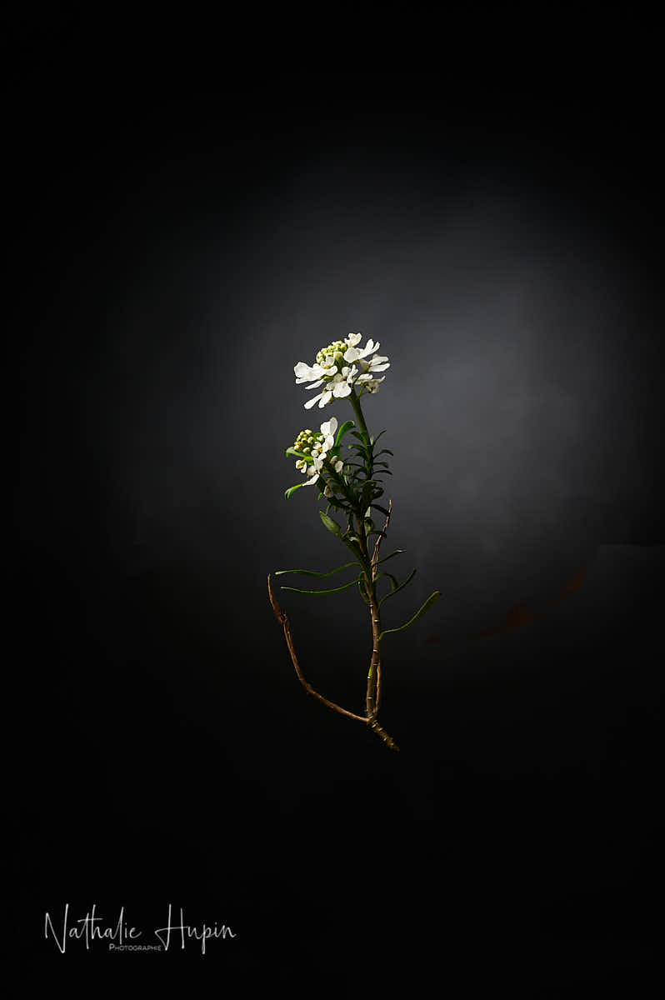

On l’appelle Corbeille d’argent ou Ibéris toujours vert _**(iberis sempervirens)**_ pour offrir un joli feuillage persistant toute l’année. C’est un couvre-sol qui permet en effet de tapisser un espace en toutes saisons. Mais on la trouve aussi à l’état sauvage et en culture spontanée sur tout le pourtour méditerranéen. Elle est très courtisée par nos amies les abeilles. (source jardiner-malin.fr)
Et c’est ma fleur du jour, de ce 21 mars 2020, comme symbole du printemps.

_La corbeille d’argent comme icône du printemps. — photographie par **Nathalie Hupin**_

> Aujourd’hui, c’est le printemps. Et on est dedans, alors qu’il y a du soleil dehors.

La vie est pleine d’imprévus. Qui aurait pu imaginer cette situation en décembre ? Assignés à demeure pour protéger notre santé, voire notre vie. C’est le 3e jour plein de confinement (on ne peut pas dire lockdown, parce qu’en théorie on peut encore sortir).

A la demande d’Elisa, j’ai été farfouiller dans les souvenirs et comme d’habitude quand j’ouvre les archives, je trouve des petits trésors. Je me dis que, finalement, c’est inestimable de garder tous ces moments de vie passée. Ces moments qui ont la caractéristique principale qu’ils n’auront plus lieu, plus jamais. En laissant la place à d’autres, indéfiniment. La vie est pleine d’imprévus.

> Astuce du jour : la corbeille d’argent est l’amie des abeilles. Le miel (du vrai de chez un apiculteur local) vous aide à renforcer votre immunité. Mangez-en tous les matins une cuiller. Attention, il est souvent recommandé pour accompagner/sucrer les infusions, mais s’il est trop chauffé, il perd ses propriétés.
