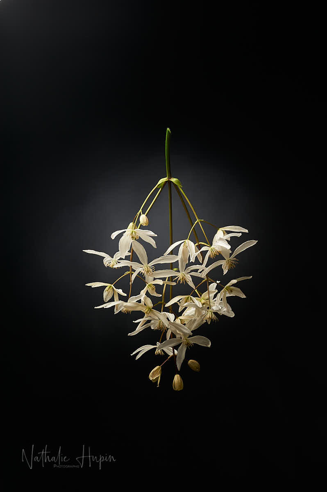

Quand j’ai planté _**Clématis Armandii**_ dans la terre super argileuse du jardin, je n’y croyais pas trop. Mais je testais et j’avais besoin d’une grimpante pour habiller le treillis qui nous séparait du terrain voisin. Chaque année je suis agréablement surprise par sa beauté, sa floraison abondante (mais trop courte à mon goût) et son parfum. Elle fait partie des renonculacées et est originaire de Chine (tout un symbole actuellement, pourrait-on dire). Son feuillage est persistant et son parfum est plus puissant fin de journée.

_Le parfum de la clématite d’Armand est suave et envoûtant. Ses effluves sont plus puissants fin de journée. — photographie par **Nathalie Hupin**_

> Envisager un confinement productif

En tant que “photographes sociaux”, nous avons dû arrêter très tôt nos activités professionnelles. Avec la peur de ne plus pouvoir redémarrer après, car pas d’activités, pas de revenus. Pas de revenus, pas de revenus. Pour une fois, nos autorités semblent tenir compte des dégâts qui vont être encourus par les entrepreneurs et cette journée du lundi a été consacrée à l’organisation administrative de la demande d’aides qui ont été créées pour cette situation exceptionnelle.

> Astuce du jour : faire des choses qu’on procrastinait, parce qu’on avait l’excuse de ne pas avoir le temps. D’ailleurs la plupart des mails qui proposent des idées d’activités dans la maison commencent par “puisqu’on a le temps”. Pour ma part, j’ai rangé des objets dont je ne me servais plus depuis au moins un an et qui encombraient.
