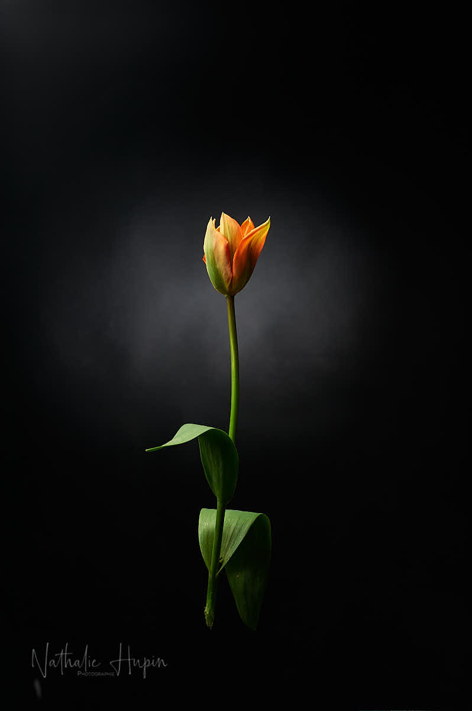

J’ai toujours aimé les tulipes. Ce minimalisme qui leur confère cette élégance simple et classique, tellement graphique. D’ailleurs, Jeroen ne s’y est pas trompé : quelques mois à peine après notre rencontre, il me faisait découvrir le Keukenhof, ce royaume magique et enchanteur des fleurs. De ce fait, j’ai essayé les tulipes dans le jardin avec une réussite mitigée. J’ai osé l’orange, même si je préfère les blanches et les noires. Je pense que je vous en proposerai encore dans ce carnet de bord, car il y a plusieurs variétés qui ont tenu le coup.

_L’élégance simple, graphique et minimaliste de la tulipe. — photographie par **Nathalie Hupin**_

> Ce matin, j’ai entendu le geai et le pic. Et j’ai vu le geai.

La nature nous survivra. Malgré tout ce que l’espèce humaine lui fait subir, elle restera. Transformée, certainement. C’est ce que beaucoup oublient. Nous, humains, ne sommes que des locataires. Et parfois, des locataires impolis, mal éduqués, idiots… Qui sait que ce virus n’est pas destiné à nous éradiquer, puisqu’il s’attaque à ce qui est vital : la respiration. Cet air que nous avons tant compromis par nos activités (principalement économiques). Comme si l’argent allait nous sauver. Quand on n’a plus de quoi manger, on a beau avoir de l’argent, il ne nous sert plus à rien.

_Les tulipes merveilleusement mises en valeur, en groupe, par centaines, au Keukenhof, en 2008. — photographie par **Nathalie Hupin**_

On parle beaucoup d’un remède, proposé par un médecin très controversé. Je m’attends d’ailleurs à ce qu’on annonce qu’il a été rayé de l’ordre des médecins, ou qu’il n’a pas son diplôme, ou un truc du genre. Le traitement qu’il propose semble tenir la route, même s’il n’a pas été testé dans les règles de l’art.

> Astuce du jour en photo : je l’ai déjà répété, mais on ne le dit jamais assez, offrez un filtre UV neutre à vos objectifs (le filtre doit être de bonne qualité pour le pas altérer la qualité optique de votre objectif). En cas de casse, le filtre protège votre lentille et vous permet parfois de sauver votre objectif. Comme ce sont des filtres à visser, il en faut un pour chaque objectif, pour qu’ils restent tout le temps dessus. Ca vous évite aussi d’utiliser le capuchon de l’objectif.
