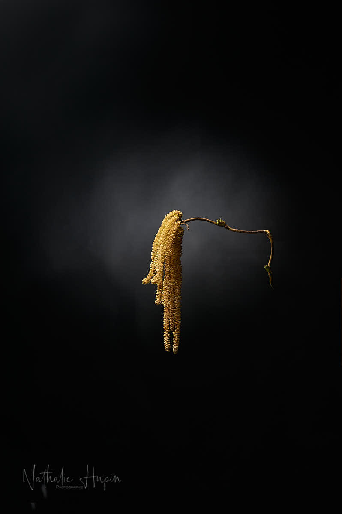
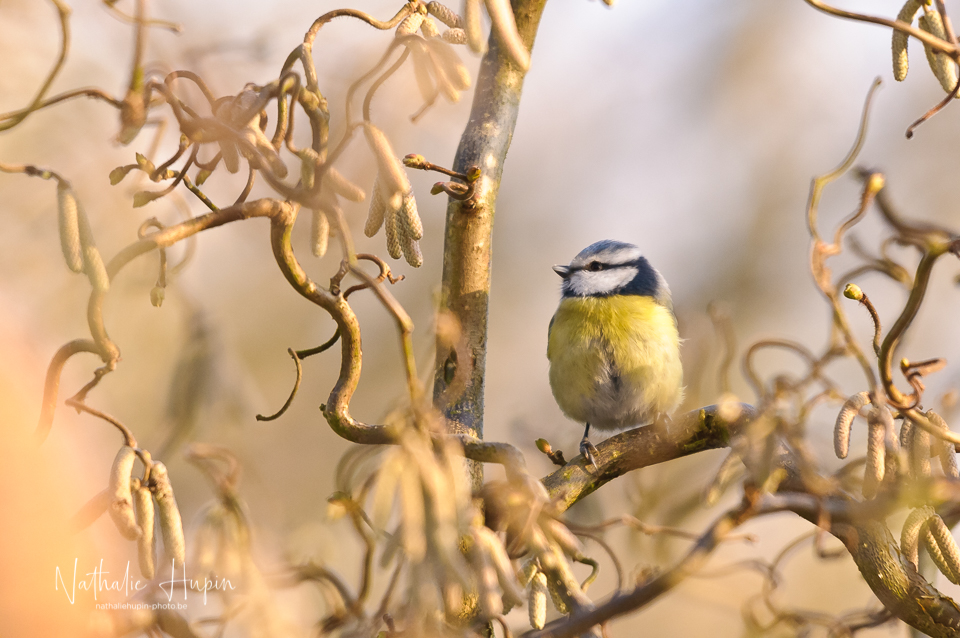

Je ne pensais pas qu’on en était déjà au 10ème jour de confinement. C’est Immaculata Meo qui me l’a rappelé. Pour ce 25 mars, j’ai choisi le noisetier tortueux (contorta) et ses chatons. Ce sont d’agréables cascades de grappes légères dorées que l’arbre porte au printemps. Ses branches sont, comme son nom l’indique, sinueuses et c’est ce qui rend sa beauté mystérieuse.

_Tel une grappe dorée : le chaton du noisetier tortueux. — photographie par **Nathalie Hupin**_

> Certains de mes amis malades voient une amélioration de leur état.

J’ai reçu des nouvelles de deux connaissances positives au Covid-19, dont une avait dû être hospitalisée. A sa grande joie, elle a pu sortir et se sent déjà un peu mieux, même si elle doit prendre de l’oxygène, car elle a toujours un peu de mal à respirer. Pour Maria, ça fait 13 jours qu’elle est malade, elle se sent mieux aussi point de vue respiration, mais elle est toujours très fatiguée. Elle espère être sortie d’affaire et sur la bonne voie de la guérison.

_Le noisetier tortueux abrite souvent les petits passereaux, comme les mésanges bleues. — photographie par **Nathalie Hupin**_

Aujourd’hui, Noëlle, Pierre et Théa devaient venir en famille pour les photos de la deuxième maternité de Noëlle. Reporter, voire annuler cette séance (car l’accouchement aura peut-être lieu durant un prolongement du confinement), me rend assez triste, parce qu’on n’aura vraisemblablement plus l’opportunité de photographier ce moment important et intime dans la vie de cette jeune famille.

> Astuce du jour : on peut manger les chatons du noisetier, comme dessert. On les trempe dans du chocolat fondu et on laisse refroidir. On peut les garnir de noisettes pilées ou de zeste d’oranges. C’est une idée de “Cuisine sauvage”, une asbl qui vous invite à préparer dans de délicieux plats les plantes sauvages, souvent erronément qualifiées de “mauvaises herbes”.
