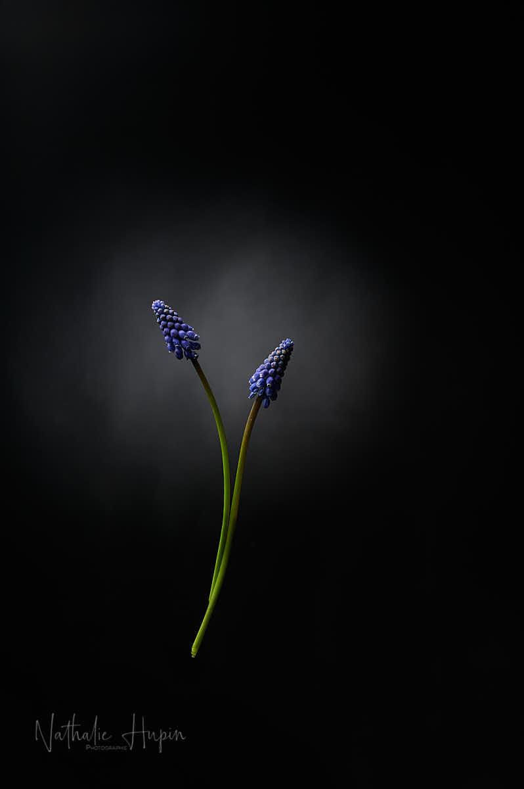
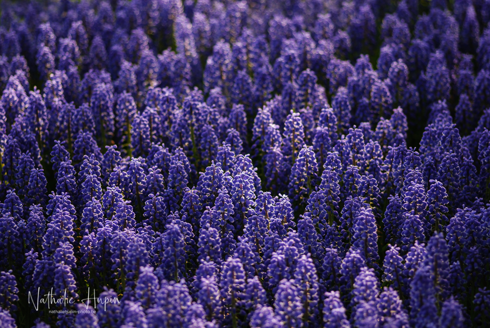

Muscari est un genre de plantes à fleurs de la famille des Asparagaceae, autrefois classé dans celle des Liliaceae. Au stade de plantule, les muscaris ne présentent qu’un seul cotylédon, ce qui le classe parmi les Monocotylédones. Appelés aussi « jacinthes à grappes », les muscaris sont des plantes bulbeuses d’assez petite taille, parmi lesquelles on distingue une quarantaine d’espèces La floraison, généralement d’un bleu-violet soutenu, a lieu tôt, à la fin de l’hiver et au printemps (fin février – mars). Le Muscari d’Arménie (Muscari armeniacum) est l’espèce la plus cultivée, dont les variétés horticoles peuvent être de diverses nuances de bleu, blanc ou rose. (source : Wikipedia)

_Photo bonus de deux grappes de muscari. — photographie par **Nathalie Hupin**_

> Il est temps qu’on redevienne sérieux et qu’on réfléchisse un peu notre rapport à la nature. (Aurélien Barau)

Aujourd’hui j’ai écouté Aurélien Barrau. J’aime bien Aurélien Barrau. Comme il le dit lui-même, il ne se sent pas un écologiste doux-dingue, ou encore un hippie avec la marguerite à la bouche.

_Muscari au Keukenhof, toujours en 2008. — photographie par **Nathalie Hupin**_

Des étudiants de Madrid ont donc demandé à Aurélien Barrau de parler de la crise que nous traversons. Voici quelques-unes de ses réflexions, auxquelles j’adhère à 200%.

“(…) Il y a globalement un problème systémique qui ne se résoudra que de manière systémique. (…) Il est temps qu’on redevienne sérieux. Le sérieux n’est pas du côté des personnes qui veulent préserver le monde tel qu’il est, car ce monde est amené à péricliter. (…)”

“(…) Il est temps de réfléchir un peu, de revoir notre rapport à la nature. Et ce n’est pas une lubie d’écologiste doux-dingue, ou de hippie avec sa marguerite dans la bouche. (…)”

“(…) Actuellement, ce qui compte, c’est l’illusion de faire. Alors que ceux qui donnent cette illusion ne font rien, ils ne guérissent pas des malades, ils ne trouvent pas de solutions (…).”

Et je terminerai avec ceci : “(…) Nous avons fait une erreur scientifique, éthique et esthétique en pensant que la nature était une simple ressource. C’est ce qu’il faut méditer aujourd’hui (…)”.

Vous pouvez retrouver [Aurélien Barrau](https://www.youtube.com/channel/UCwgqYNmYaij2_8hq_tOFyZw) sur youtube.

> Astuce du jour : Bien que la plupart des muscaris actuellement cultivés soient inodores, le nom de « Muscari » vient du grec muschos, (musqué), car certaines variétés ont une odeur musquée. (source&nbsp;: Wikipedia)
