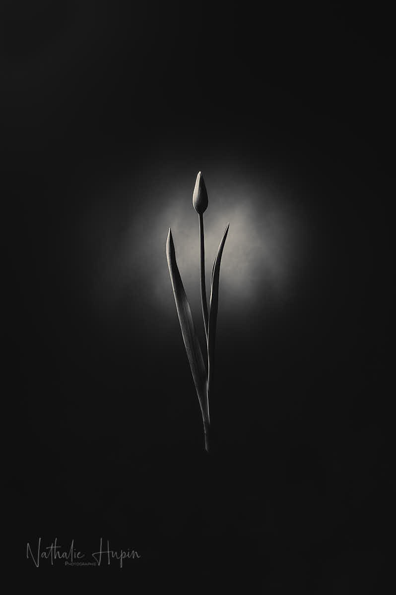
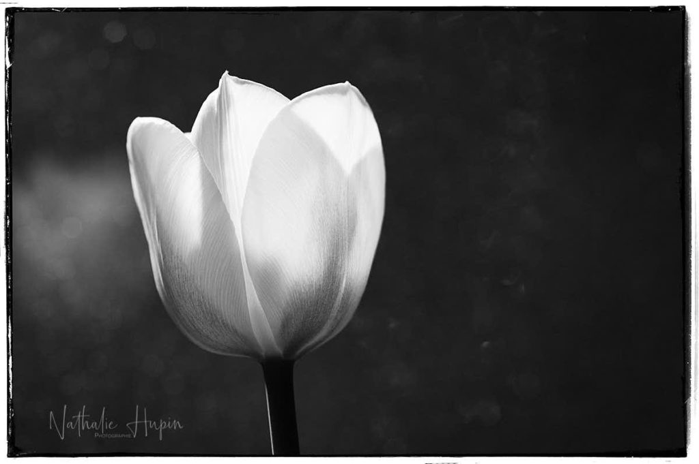

Aujourd’hui, exceptionnellement, les photos que je vous présente sont en noir et blanc. Exceptionnellement, parce que je trouve que la couleur sied mieux au sujet, et aujourd’hui, parce que mon coeur est entre gris clair et gris foncé, face à cette crise sanitaire. C’est une tulipe, j’adore la tulipe. J’aime son aspect graphique quand elle est encore fermée, son minimalisme. Et son côté léger et aérien une fois ouverte.

_Pour moi, la tulipe est tout aussi belle prête à éclore que quand elle déploie ses délicieux pétales. J’aime sa forme effilée et ronde à la fois. — photographie par **Nathalie Hupin**_

> Est-ce que c’est parce que j’ai la désagréable impression qu’on nous ment, que la plupart des faits concernant la gestion de cette crise en Belgique tendent à me prouver que j’ai raison ?

On nous ment. On vous ment. On te ment. On leur ment. En qui avoir encore confiance durant cette épreuve ? Moi je dirais au personnel de première ligne et pas à ceux qui ont été mandatés (!) pour diriger l’action. Elles l’avouent d’ailleurs elles-mêmes, ces premières lignes (au moins, elles sont honnêtes, contrairement aux autres), elles n’ont pas voulu et ne veulent pas être des héros. On les y a forcées et on les envoie au combat sans aucune protection. C’est assez paradoxal de se dire que nos dirigeants belges ont dépensé autant d’argent pour acheter des avions de combat et qu’on n’a pas besoin de l’armée en tant que telle ici et maintenant pour mener la bataille. Qu’on avait juste besoin de matériel de protection assez simple pour tous les soignants, ces personnes qu’on considère à tort et malheureusement comme des “petites mains”. Qu’on nous dit maintenant que ce matériel n’est pas nécessaire , uniquement parce qu’on n’en a pas. Et quand on en aura, ça sera obligatoire d’en porter. C’est tout simplement honteux. Et heureusement, il y a des personnes assez perspicaces pour s’en rendre compte et d’autres, courageuses, pour le dénoncer. Au risque de subir une décrédibilisation en règle. Voilà pourquoi mon coeur est très noir aujourd’hui, parce qu’on est bien conscient qu’on est pris au piège et conscient aussi qu’il n’y a pas moyen de s’en sortir en l’état actuel des choses. Je ne me plains pas du confinement, je me plains de ne voir comme horizon jusqu’à présent “no future”.

_Passionnée de lumière et de ses jeux, j’aime beaucoup la transparence des pétales de tulipes. — photographie par **Nathalie Hupin**_

> Astuce du jour : continuez à développer votre sens critique et continuez à vous éduquer. Toujours.
