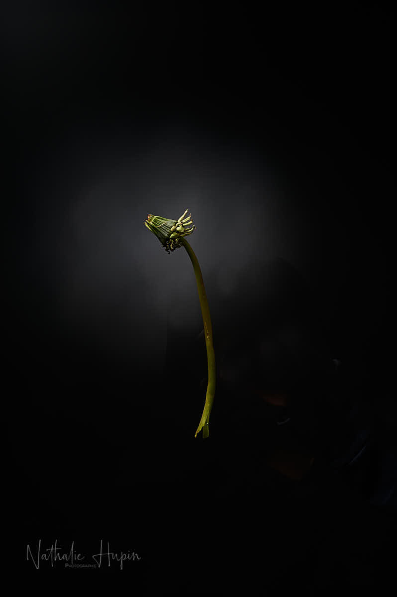

J’ai choisi, pour ce 1er avril, date annuelle de la blague en tous genres, une plante que beaucoup considèrent comme uen mauvaise herbe. Or la dent-de-lion (ou pissenlit) possède quelques vertus, dont celle d’être mangée en salade. Ca pourra toujours servir quand il n’y aura plus d’approvisionnement.

_Le pissenlit est renommé en phytothérapie pour apaiser le foie, cet organe essentiel du corps humain. — photographie par **Nathalie Hupin**_

> Le cauchemar devenu réalité

Je pars du principe que les films dits de science-fiction ne sont jamais entièrement de la pure fiction. Leur auteur, leur scénariste, entrepose dans un coin de sa tête des pensées qu’il craint ou qu’il anticipe. Un jour, il les traduit en mots ou en images ou les deux. Il y a de nombreux récits qui ont pour sujet une épidémie terrifiante ou une pandémie (dont un titre éponyme d’ailleurs). Parce que notre civilisation a dû faire face à intervalles à des maladies contagieuses et/ou mortelles. Ces épisodes tragiques qui ont entraîné des milliers de victimes se sont jusqu’à présent résolus. On a trouvé un médicament et /ou un vaccin et on est passé à autre chose. La vie des humains a continué et plus tard a fait place pour une nouvelle maladie qui a nécessité des recherches pour trouver le remède. Pourquoi voudrait-on croire à ce professeur marseillais qui clame que le remède est là sous nos yeux ? Parce qu’on aimerait bien au fonds de nous ne pas vivre ce qu’on connaît par les livres d’histoire. Ces séparations douloureuses, parce que nos proches quittent cette vie. Parce qu’on croit que la technologie actuelle est plus efficace qu’il y a 100 ans ou 200 ans (beaucoup d’entre nous considèrent encore, erronément certainement, que c’étaient des barbares). Ma question aujourd’hui : que va-t-il se passer s’il n’y a pas de remède, finalement ? Si les malades guéris rechutent, et, plus gravement lors de la deuxième attaque ? Est-ce que l’heure de notre disparition est réellement venue ?

> Astuce du jour : même si on utilise principalement les racines en phytothérapie, ce sont ses feuilles qu’on mange en salade. Si l’amertume vous inquiète, il faut laisser tremper les feuilles dans l’eau salée environ 1 heure. C’est délicieux avec une vinaigrette moutarde et des oeufs cuits durs tranchés et mélangés aux feuilles.
