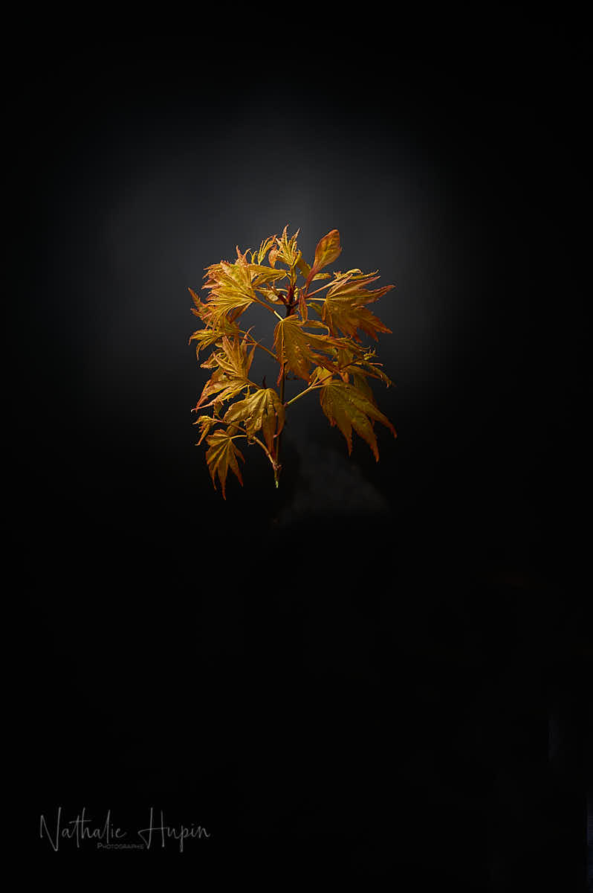

Je dédicace ce divoc du 2 avril à Benoit Choteau. J’ai rencontré Benoit lors du mariage de sa fille Caroline, duquel j’assurais le reportage photo. Il est par la suite venu suivre une formation photo et c’est ainsi que j’ai découvert qu’il était le créateur d’une pépinière tout près du studio spécialisée en arbres japonais, dont il est un grand admirateur. Les essences phares qu’il propose sont les érables du Japon (Acer japonicum).

L’érable du Japon est un arbre à feuillage caduc, originaire des sous-bois des forêts mixtes tempérées de Chine, du Sud de la Corée, du Japon et de Russie. Il peut atteindre 12 à 15 m de haut à l’état naturel. Il appartient à la section Palmata de la classification des érables.

_J’ai plusieurs érables dans le jardin, mais celui-ci est le premier à sortir ses feuilles à la forme si caractéristique. Pour l’instant, elles ne sont pas encore complètement déployées, mais arborent déjà une jolie couleur feu. — photographie par **Nathalie Hupin**_

> Un peu de beauté colorée dans la grisaille

Les pépiniéristes sont de grands perdants de cette crise sanitaire, avec d’autres corps de métiers bien sûr. Néanmoins, le confinement a commencé alors que leurs activités reprenaient après l’hibernation de l’hiver. Ils ont été obligés de fermer leur commerce immédiatement, car leur profession n’était pas considérée comme essentielle. Heureusement, certains d’entre eux, dont Benoit Choteau, ont décidé de réagir et peuvent livrer leurs magnifiques créations au domicile de leurs clients. Même si le coeur n’y sera peut-être pas vraiment, vous seriez bien étonnés des bienfaits que peut apporter à votre demeure un arbre coloré à la forme unique.

> Astuce du jour : je vous invite donc à visiter les pépinières Choteau, sur leur site pendant le confinement, celui-ci est rempli de nombreuses images colorées. Quand on pourra sortir, allez jusque chez eux, le déplacement en vaut la peine. Ca se situe à Bray, à quelques kilomètres de Binche.
