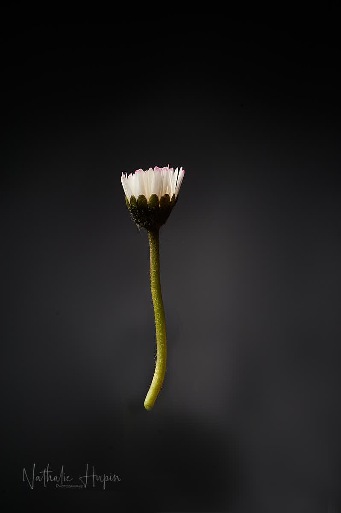

Avez-vous déjà regardé une pâquerette sous cet angle et d’aussi près ? Je ne crois pas non, car nous les voyons toujours par le haut et, la plupart du temps, nous n’y prêtons même pas attention. Parce que ce sont des petites plantes qui sont souvent aussi considérées comme des indésirables.

La pâquerette est une vivace qui fait partie des Astéracées. Son nom latin est Bellis perennis. Et c’est le végétal que je vous présente ce 3 avril 2020.

_La pâquerette est l’amie des enfants, qui l’utilisent parfois pour en confectionner une guirlande printanière. — photographie par **Nathalie Hupin**_

> Impossibilité de répondre à la demande

Aujourd’hui, le confinement m’a vraiment pesé, car j’ai reçu un message d’une cliente qui a accouché (quel courage d’accoucher en ce moment, même si on ne décide pas vraiment du moment, forcément, et que la conjoncture actuelle n’était pas vraiment prévisible) et qui souhaitait bien légitimement photographier son nouveau-né. En lui répondant et en réfléchissant en même temps que j’écrivais (parce que je voulais lui trouver une solution qui ne met en danger aucun d’entre nous, s’il en existait une), je me suis dit que je ne parviendrais pas à répondre à sa demande. Même avec une séance photo en extérieur avec un téléobjectif pour respecter les distances de sécurité. Finalement, on est bien peu de choses et en quelques semaines, toutes les situations, notre vie, notre confort, nos habitudes, tout peut basculer. Pourtant, on ne parvient pas toujours à s’appliquer carpe diem comme mode de vie.

> Astuce photo du jour : pour obtenir ce coéfficient de rapprochement d’un aussi petit sujet, un objectif traditionnel ne suffit pas, même si c’est une focale fixe. Il est incontournable d’utiliser un objectif dit “macro”.
