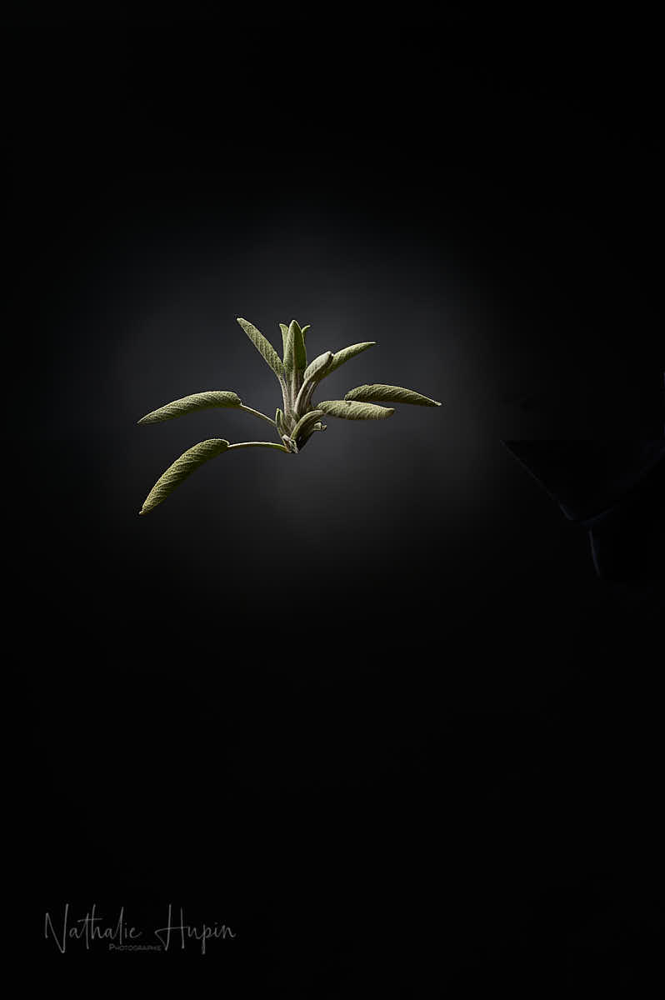

Les sauges forment le genre Salvia. Ce sont des plantes de la famille des Lamiacées qui comprend plus de 900 espèces, annuelles, bisannuelles, vivaces ou arbustives. Une dizaine de sauges sont indigènes en Europe, par exemple la sauge des prés (Wikipédia).

Elle contient des antioxydants et de l’acide rosmarinique, qui contribuerait à son action neuro-protectrice et anti-inflammatoire. L’usage de la sauge est reconnu pour traiter les troubles digestifs fonctionnels et la transpiration excessive (Passeport santé).

_J’aime beaucoup l’aspect et le toucher des feuilles de sauge : elles ressemblent à du velours végétal, doux et lisse. — photographie par **Nathalie Hupin**_

> Solidarité privée et organisée

Il y a bien évidemment un aspect très positif à ce cauchemar : la solidarité qui s’organise. C’est juste trop beau de constater que la plupart d’entre nous ne supportent pas la misère d’autrui et se mettent en action avec leurs moyens pour atténuer cette misère. C’est bien plus positif que des querelles d’ego dans des partis politiques ou même des guerres. J’espère qu’on s’en souviendra quand tout sera derière nous.

> Astuce du jour pour bénéficier des vertus curatives de la sauge : portez l’eau à ébullition, puis versez-la sur les feuilles de **sauge**. Couvrez afin de ne pas laisser s’échapper les principes actifs et laissez infuser une dizaine de minutes environ. Filtrez. Buvez une tasse de cette infusion plusieurs fois par jour, en fonction de vos symptômes.
