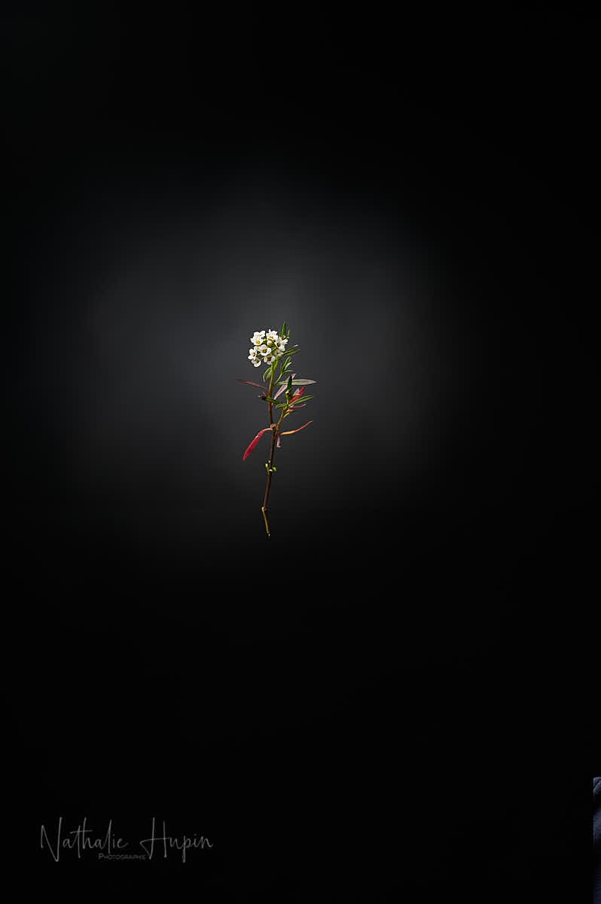

Très utilisée pour fleurir les murets de pierres sèches ou les rocailles, l’alysse est l’une des plantes décoratives les plus faciles à cultiver. Autrement nommée corbeille d’or ou corbeille d’argent, elle se couvre de minuscules fleurs serrées en bouquets pendant une très longue période. Une plante à adopter par tous les jardiniers qui ont peu de temps à consacrer à l’entretien !

_Je vous avais déjà présenté une corbeille d’argent il y a quelques jours, mais celle-ci est une autre variété, annuelle, qui se resème à mon grand bonheur. — photographie par **Nathalie Hupin**_

> Bouli Lanners en colère

C’est mon sourire du jour : le coup de gueule de Bouli Lanners à propos du comportement de nos politiciens dans cette crise. C’est vrai que c’est assez agaçant qu’on nous prenne pour des cons et qu’on mente sur tout ce qui s’est passé depuis le début. Aujourd’hui moi aussi je suis en colère. Et je remercie Bouli de l’avoir dit mieux que moi.

> Astuce du jour : la colère est une émotion, et les émotions, ça passe. La colère est mauvaise conseillère. Bonne nouvelle : on la sent arriver. Si vous vous sentez en colère, isolez-vous. Ca vous évitera de blesser des personnes qui vous sont chères, parce que vous étiez sous l’emprise de la colère. Mon truc pour attendre que la colère se passe, c’est d’accomplir une activité instinctive, qui ne demande pas trop de réfléchir. Comme regarder les chats qui jouent ou les oiseaux dans le jardin.
