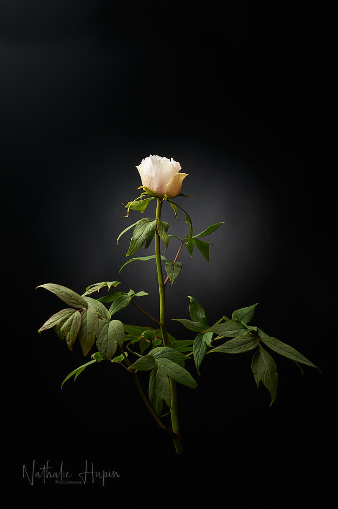
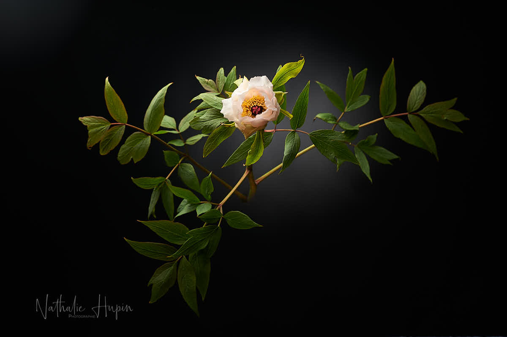

Avec les coquelicots et les lilas, les pivoines sont mes fleurs préférées. La première à fleurir est la Paeonia suffruticosa, la pivoine arbustive. Appelée aussi pivoine Moutan, elle est originaire de Chine et plus précisément de l’Himalaya. Les fleurs sont simples avec une dizaine de pétales maximum et apparaissent habituellement en mai-juin. Elles sont solitaires au bout d’une longue hampe et éblouissent par leur finesse et leur perfection.

_J’adore toutes les pivoines. Celle-ci est la première à fleurir, chaque année. - Photographie par **Nathalie Hupin**_

> Même si j’ai envie de vous présenter toutes les pivoines de mon jardin, j’espère que cette crise s’arrêtera avant leur éclosion

J’aime tellement les pivoines, que j’en ai planté plusieurs vatiétés dans le jardin. Comme leur floraison est étalée, quand l’une commence, l’autre se termine, ce qui veut dire que j’en bénéficie jusque fin juin. J’ai vraiment envie de toutes vous les présenter, tant je les trouve belles. Et en même temps, je préférerais ne pas le faire, parce que ça signifierait qu’on est enfin sortis de cette crise.

Pour l’instant, je suis encore optimiste. Mais je manque de patience (je suis comme ça, j’essaie de me soigner, mais c’est assez difficile). J’espère encore qu’il y aura un bout du tunnel, même si cet espoir rétrécit au fil des jours qui passent.

Un aspect de cette crise que je trouve assez désagréable, c’est d’apprendre que des personnes que tu apprécies, mais dont tu n’es pas ou plus spécialement proche, sont malades. Non pas que je le reproche à ces personnes de ne pas l’avoir annoncé plus tôt (elles ont bien d’autres chats à fouetter que de lancer une annonce officielle sur leur état de santé), mais je trouve que c’est assez flippant, en même temps qu’être utile, ce bulletin des positifs. Et pourtant, c’est bien un des aspects intéressants des réseaux sociaux, s’ils n’existaient pas, l’information mettrait plus de temps à circuler.

> Astuce botanique du jour : les pivoines n’aiment pas être dérangées, elles se contentent de peu d’attention pour faire des fleurs somptueuses si leur emplacement leur convient. Au printemps, nourrissez la pivoine avec du fumier, compost, poudre d’os ou de corne. Supprimez les fleurs fanées. Ne paillez pas le pied, cela favoriserait les maladies cryptogamiques. (source : <https://jardinage.lemonde.fr>)
