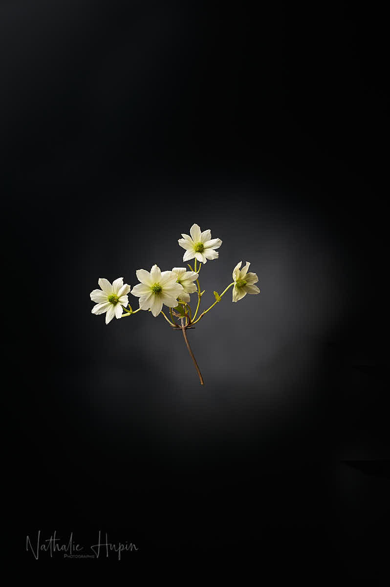
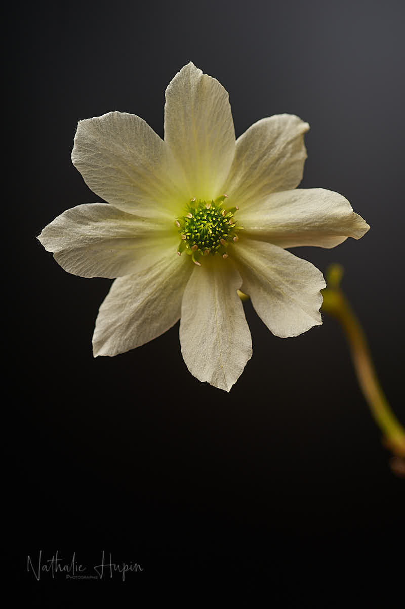

Un des grands principes en photographie, et avec lequel on doit tenir compte, c’est qu’on capture une scène en trois dimensions en la limitant dans un cadre de deux dimensions. Cette dimension perdue est exprimée par la profondeur de champ, concept qui n’existe qu’en photo (dûe aussi à l’utilisation des optiques – en gros résumé). Pour donner une profondeur supplémentaire à un jardin, rien de tel que des grimpantes qui vont apporter de la hauteur. C’est efficace pour les espaces petits ou pour des jardins comme le mien (très étroit en longueur). Donc j’ai planté quelques grimpantes, dont clématites et glycines. La plupart des clématites sont en boutons en ce moment, par contre, je vous ai présenté Armandi il y a quelques jours. Et une deuxième d’entre elles a commencé à fleurir, la clématite avalanche.

_Originaire de Nouvelle-Zélande, la clématite avalanche se distingue par sa floraison généreuse en cascade. - Photographie par **Nathalie Hupin**_

> Donner de la profondeur en hauteur à son jardin

Ses fleurs sont tout simplement magnifiques, avec un cœur rempli d’étamines jaune pâle et des pétales blancs rappelant ceux des marguerites. Elle peut atteindre trois mètres de hauteur pour deux mètres de large quand elle est adulte.

Peu connue, elle convainc facilement les personnes qui la croisent, plus encore si elle est en pleine floraison !

Aujourd’hui, en Belgique, on est un peu groggy avec les chiffres “corona”, dont les décès ont grimpé en flèche, vraisemblablement en raison du mode de calcul. Cependant, il est regrettable de constater qu’on en est au même point que les autres pays européens. Et qu’on ne pourra pas limiter la casse. Elisa s’inquiète pour son cursus scolaire, car les étudiants aimeraient être plus ou moins fixés sur leur sort : quelle valeur aura leur diplôme, si on l’ampute d’une partie des matières qui devaient être acquises et qu’on laisse passer tout le monde ? Par contre, s’il y a des examens, sur quelle matière vont-ils être interrogés ? J’espère qu’on ne va pas rester dans l’incertitude trop longtemps.

Cette nuit, c’est lune rose !

> Astuce photo du jour : la profondeur de champ est votre grande amie pour construire votre message photographique. Elle doit être choisie judicieusement pour mettre en valeur le sujet. Dans certains styles, on optera pour une grande zone de netteté, dans d’autres, on réduira cette dernière à son minimum (auquel cas, un contrainte technique conséquente vient s’ajouter : la mise au point doit être nickel et elle sera cependant plus difficile à réaliser).
