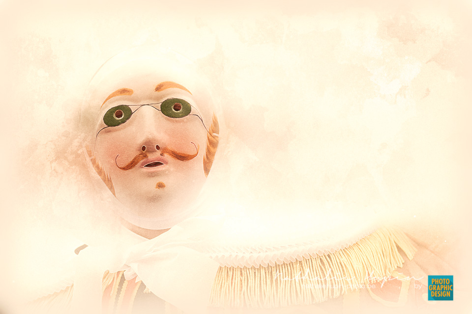

Avez-vous deviné que j’ai une affection particulière pour les fleurs de couleur blanche ? Je vous ai déjà présenté un narcisse il y a quelques jours. Il était particulier, car il était double. Voici son petit frère, simple et entièrement blanc. N’oubliez pas que les narcisses sont des plantes toxiques (ils contiennent de la galantamine).

_Le narcisse est comporte six tépales pétaloïdes. Les étamines, aussi au nombre de six, sont insérées dans une couronne ou paracorolle en coupe ou trompette. - Photographie par **Nathalie Hupin**_

> Les masques

J’aime bien vous parler des masques, peut-être parce ce que je suis originaire de Binche la ville du masque et du carnaval. Et que je suis passionnée par le masque du gille de Binche, ce petit accessoire quasi identique, mais pourtant unique, qui confère l’égalité à chaque gille le temps qu’il est porté.

Donc, on apprend que les masques commandés pour protéger le personnel soignant au front et en danger ne conviennent pas. On apprend aussi aujourd’hui que des soignants malades avec de la fièvre étaient obligés d’aller travailler (avec le risque qu’ils soient atteints de covid19 et qu’ils le refilent aux patients dont ils s’occupaient). Et on s’étonne que le nombre de cas explosent ? Parce qu’en chiffres absolus en fonction du nombre d’habitants, la Belgique est dans le top 3 des pays qui subissent le plus de décès. Depuis le début de cette crise Corona, et avec les décisions prises au tout début de la maladie (alors qu’on pouvait encore peut-être la contenir), j’ai toujours trouvé que les décisions du SPF santé allaient à l’encontre du bon sens si on voulait gérer correctement cette crise. Oui pour rapatrier les belges vivant en Chine, mais avec une quarantaine sérieuse, ce qui n’a pas été fait. Oui pour tester ceux qui revenaient d’Italie (vacances de carnaval), ce qui n’a pas été fait. Et ce n’est pas comme si ça nous tombait dessus, parce que les informations, même tronquées, on les avait obtenues des pays qui ont été les premiers victimes de la maladie. Donc, on pouvait anticiper. Mais on ne l’a pas fait. On a rigolé, banalisé, insulté les professionnels de la santé (qui demandaient déjà plus de rigueur). Il faudra que les responsables assument, bien qu’ils ne pourront jamais réparer à la hauteur du mal qu’ils ont commis et de tous ces décès. Mais au moins peut-être aurons-nous encore foi dans la justice…

> Conseil du jour : portez un masque quand vous quittez votre maison. On n’est jamais trop prudent. Pas celui du gille de Binche, mais un masque plus ou moins conforme qui vous protégera des méchants virus.
