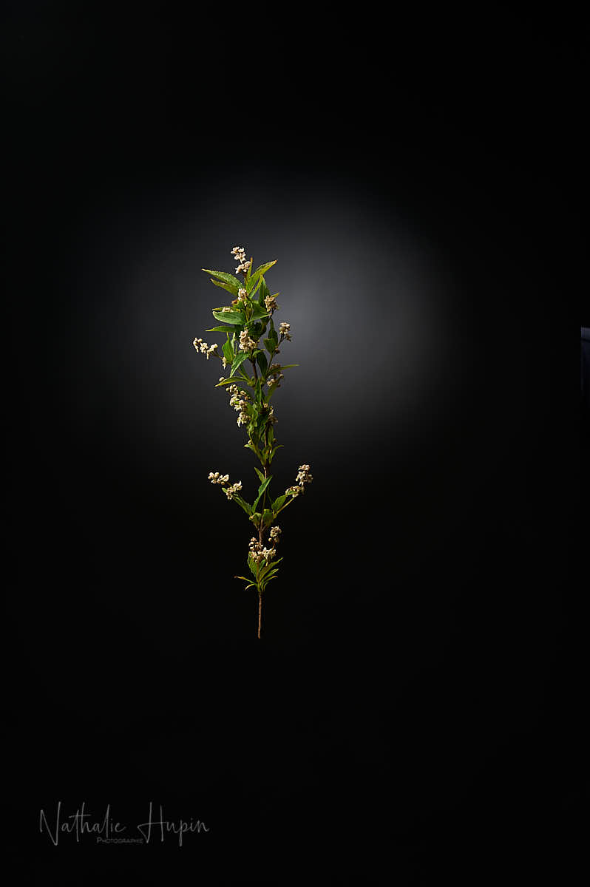

J’avais lu quelque part que les orties perdaient leurs capacités urticantes une fois trempées dans l’eau. Je peux vous confirmer que c’est une légende urbaine. Depuis le matin, mes extrémités de doigts en sentent encore les effets. Fâchée avec les orties pour aujourd’hui, c’est un autre végétal que je vous présente. Un petit arbuste rempli de fleurs blanches dont j’ignore le nom et qui fleurit habituellement début mai.

_Photographie par **Nathalie Hupin**_

> Pas de commentaires pour aujourd’hui

La situation en Belgique est bien trop catastrophique pour encore savoir à quel saint se vouer. Je n’ai pas envie d’en parler :-(

> Astuce santé/cuisine du jour : l’eau d’ortie est remplie de bienfaits. On prend un belle poignée d’orties (les jeunes feuilles du dessus de la tige), on les met dans un litre d’eau froide et on laisse macérer à température ambiante pendant une nuit. Filter les feuilles et c’est prêt ! Cette boisson est remplie de sels minéraux, de silice biodisponible. Cette boisson va amorcer des processus dépuratifs et d’élimination et par conséquent, épauler votre système immnitaire. Je teste demain et je vous donne un feedback.
