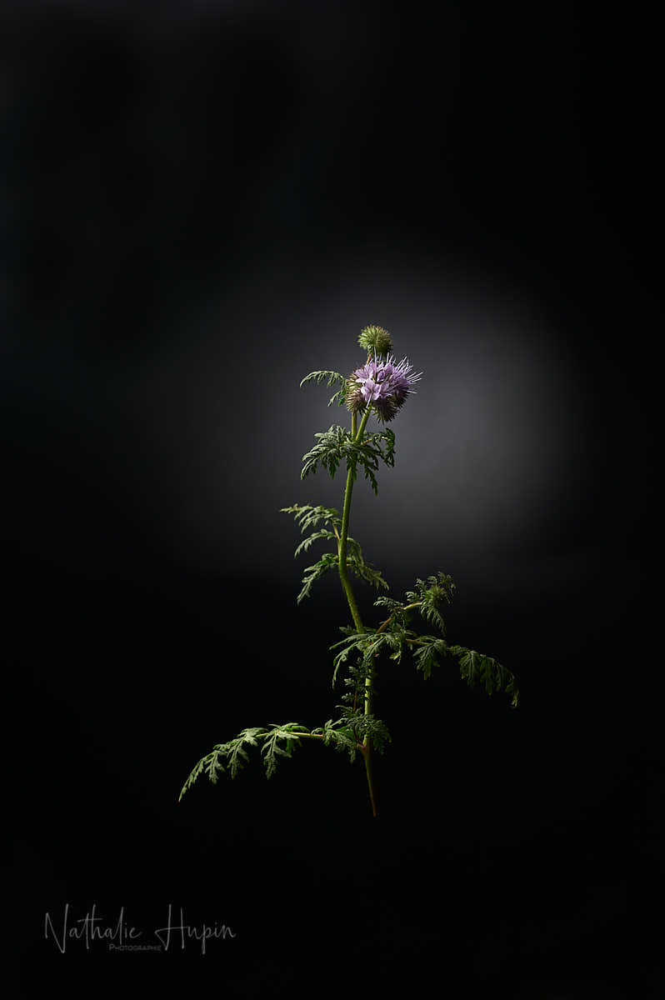

J’ai découvert la phacélie il y a quelques années : un sac de semences (avec de la lavande) était offert quand vous vous rendiez au parc à conteneurs. Parce que la phacélie est une plante amie des abeilles et un engrais vert. Elle travaille donc à la place du jardinier. Quand elle a terminé sa floraison, la lavande prend sa place. Bon, chez moi, avec la terre super argileuse, je n’ai pas vraiment un sol propice aux lavandes, malheureusement. Je me contente donc de la phacélie, puisqu’elles sont plus ou moins de la même couleur et qu’elle se resème chaque année en se déplaçant.

_Avec ses feuilles bien découpées (feuillles de Tanaisie) et sa tête mauve, la phacélie est très esthétique pour toutes sortes de photos. - Photographie par **Nathalie Hupin**_

> Les Belges ont-ils bien compris le sens du mot confinement ?

Aujourd’hui, j’ai dû parcourir une distance d’environ 10 km en voiture, dans des chemins campagnards. Je dois reconnaître que j’ai été assez surprise de constater qu’il y avait autant de voitures, autant de joggeurs (qui courent sur la route, croyant être les seuls usagers), autant de cyclistes, autant de parents avec poussettes, autant de propriétaires de chiens avec leurs chiens. Mis à part sur la Grand-Place de Binche, qui était déserte de voitures (ce qui est étrange pour un samedi, mais logique, puisque le pays est confiné), je n’ai jamais vu autant de monde. Je n’en reviens pas. Sans parler des va-et-vient de certains de mes riverains, qui reçoivent chez eux quotidiennement des personnes différentes… J’ai l’impression que toutes ces personnes aimeraient que ce confinement se prolonge plus longtemps. Oui, mais… ont-elles pensé qu’il y a des personnes malades et des personnes qui meurent, des personnes qui sont hospitalisées, d’autres isolées, des personnes sans emploi (et sans revenu) ? Je suis bien d’accord que la météo très (trop) agréable pour la saison joue un rôle dans cette soudaine désinvolture, mais il faut quand même assumer un peu ses responsabilités individuellement et ne pas venir se plaindre le jour où on tombe malade, ou des proches à soi tombent malades. Parce que “Qui fait le malin…”

> Astuce du jour : il y a quand même à ce jour, après à peine un mois de déclaration de la pandémie dans notre pays, plus de 3000 décès. Sur 10 millions d’habitants, c’est un triste record dont on se passerait bien. Ce n’est pas le moment de lâcher la bride.
