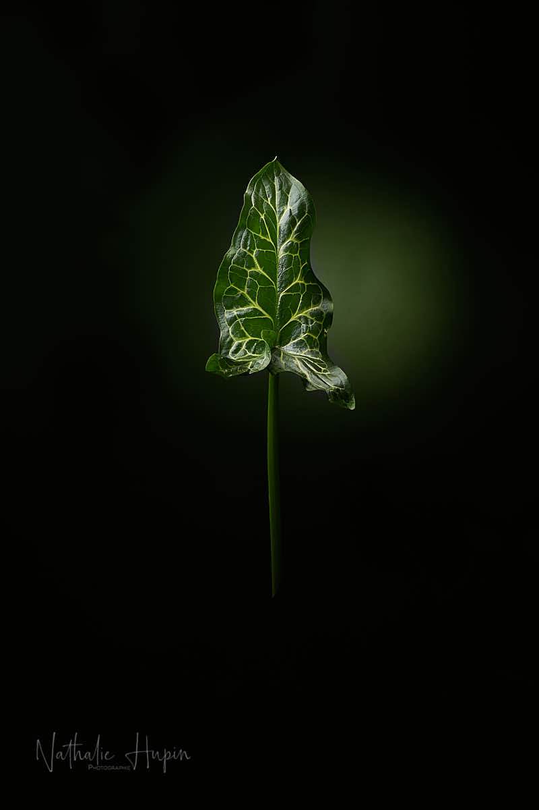

Aujourd’hui, c’est dimanche de Pâques et pour beaucoup d’entre nous, c’est la première fois de notre vie que nous fêtons de cette manière, sans fête de famille. Alors, pour sortir de la récurrence Divoc, j’ai osé une petite fantaisie, avec une touche couleur. Le vert est la couleur du printemps, des feuilles, de la renaissance de la nature et de l’espoir.

_Arum italicum (arum italien). - Photographie par **Nathalie Hupin**_

> Plantnet, l’application qui vous permet de reconnaître les plantes

J’ai installé Plantnet hier sur mon smartphone et elle a déjà bien travaillé. C’est juste génial : tu photographies la plante et elle te dit c’est quoi comme plante. C’est assez précis. J’adore. Donc, voilà la première performance de Plantnet et j’en suis contente. Cette plante aux grandes feuilles bien dessinées s’est installée toute seule dans le jardin (sans que je l’y plante) et elle continue de se développer à mon grand plaisir. C’est une partie d’Italie qui me rappelle les amis qui vivent là-bas (elles et ils se reconnaîtront).

_Concert de Stephan Eicher à Bruxelles au Cirque Royal en décembre 2019. - Photographie par **Nathalie Hupin**_

> Astuce du jour : Stephan Eicher est un de mes chanteurs préférés et pourtant, le folk, ce n’est pas réellement ma tasse de thé. Tous les jours, il offre un petit concert de sa cuisine sur sa page Facebook. Si vous ne le connaissez pas, je vous invite à le découvrir. Si vous connaissez, allez-y, vous allez vous régaler. (Page Facebook de Stephan Eicher). Des chansons que j’aime : Combien de temps (évidemment), Rien n’est si bon, Donne-moi une seconde, entre autres…
