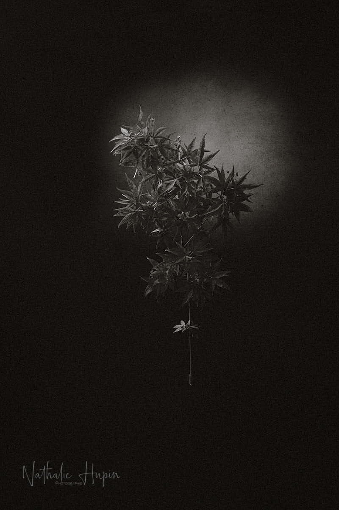

Nous sommes lundi de Pâques et c’est encore “jour férié”. Donc la photo que je vous proposerai aujourd’hui sortira un peu de la série Divoc, parce qu’elle sera en noir et blanc. Je trouvais que l’expression de ce visuel uniquement en niveaux de gris lui allait parfaitement bien, même si les couleurs d’un érable du Japon sont quasi toujours flamboyantes en toutes saisons.

_Acer palmatum. - Photographie par **Nathalie Hupin**_

> Ce confinement commence à sembler long

Je dois bien le reconnaître (et pourtant je ne suis pas dans la situation la plus inconfortable, car j’ai un toit et de quoi m’occuper) : ce confinement commence à sembler long. Et pourtant, je pense qu’il va encore être prolongé jusqu’à la fin du mois. On en saura plus mercredi. Le gouvernement patauge dans cette gestion de crise et j’ai de plus en plus peur qu’il ne sait absolument pas ce qu’il fait. Avons-nous un futur ?

> Astuce du jour : Les érables du Japon ont besoin d’une terre acide. C’est important d’en tenir compte quand on les installe en pleine terre : il faut creuser un grand trou pour leur apporter cette terre dont ils ont besoin.
