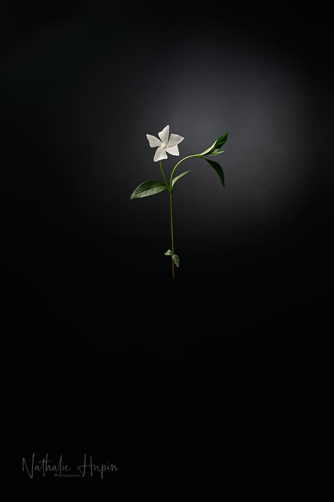

Vinca minor (petite pervenche) est pour moi comme une Madeleine de Proust. Elle était très présente chez mes grands-parents maternels qui avaient dans leur jardin, sur la terrasse, une pièce d’eau entourée de rocailles. Ces rocailles abruptes étaient recouvertes de pervenches mauves, de myosotis, de campanules et de bleuets. Comme ils étaient catholiques pratiquants, la pièce d’eau était surplombée d’une “grotte” avec la statue de la vierge, comme à Lourdes (je crois d’ailleurs que la statue venait de là). L’eau était recouverte de nénuphars et je me souviens d’une année, en juillet, d’une invasion de coccinelles. Il y en avait des dizaines par feuilles !

_La petite pervenche est une plante herbacée pérenne de la famille des Apocynacées. - Photographie par **Nathalie Hupin**_

> La pervenche présente aussi des vertus médicinales

Plante astringente, diurétique, dépurative, tonique et vulnéraire. Elle est utilisée pour les troubles de la mémoire, ainsi que pour les mains et doigts froids (maladie de Raynaud), elle agit comme un neuro-dilatateur contre la mauvaise circulation artérielle dans le cerveau (ischémie cérébrale) et les troubles fonctionnels dus à l’artériosclérose, tels les vertiges et les bourdonnements d’oreilles et l’hypertension. Elle aurait des vertus anti-cancéreuses. Une plante dont on peut utiliser les feuilles en infusion. Enfin, elle protège contre le froid de l’hiver : on l’utilise fréquemment en gargarisme contre les angines.

> Astuce du jour : Ce sont les feuilles séchées de cette petite vivace qui servent généralement comme grand remède contre l’insuffisance circulatoire cérébrale. Il vous suffit de les récolter avant la floraison (de l’automne au mois de mars) et de les faire sécher à plat dans un endroit sec et aéré. Utilisées en décoctions, les feuilles de petite pervenche aideraient à lutter contre plusieurs maux. Pour cela, mettez 30 à 50 g de feuilles séchées dans une théière. Versez un litre d’eau bouillante et laissez infuser quelques minutes. Buvez 2 à 3 tasses par jour.
