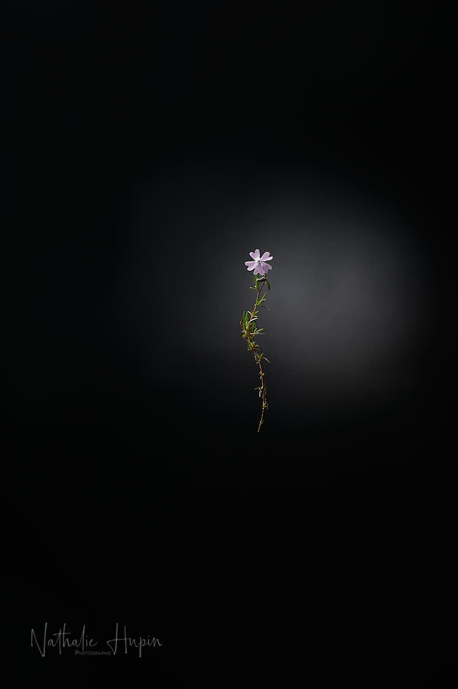

Phlox subulata est une plante vivace rampante. Son port compact se développe en forme de coussin. Espèce couvre-sol, elle peut mesurer de 10 à 20 cm de hauteur. Ses tiges diffuses et couchées s’enracinent au fur et à mesure. Les fleurs en forme d’étoile sont constituées d’une corolle tubulée formée de pétales échancrés. La floraison printanière est abondante et dure de deux à trois semaines. Les fleurs s’épanouissent jusqu’à recouvrir totalement le feuillage. Lorsque les conditions sont favorables, la plante offre un tapis de fleurs colorées très fourni, pouvant être rose pâle, rose vif, rouge, violet, blanc et parfois bicolore ou encore marqué d’un cœur rose vif. Elle se plait dans des endroits escarpés. (source : Wikipédia)

_Phlox subulata est très appréciée pour les qualités ornementales de ses fleurs. - Photographie par **Nathalie Hupin**_
