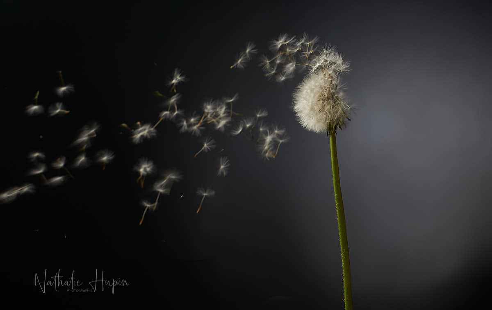
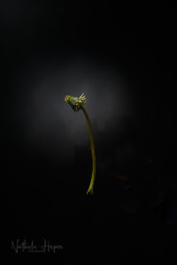
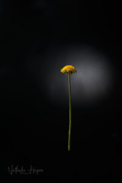
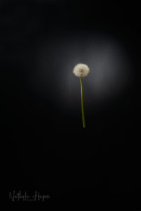
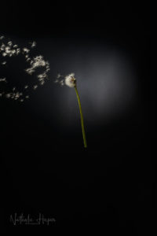

Nous avons tous oublié que notre vie peut être aussi éphémère que cette fleur qui sème au vent. Elle meurt dès qu’elle donne la vie et assure un avenir à son espèce… N’empêche que je trouve cette fleur toujours aussi esthétique quand elle s’éparpille dans l’espace.

_Sème au vent. - Photographie par **Nathalie Hupin**_

> En quelques jours, la fleur du pissenlit éclot, sème et meurt

Nous ne sommes que de passage sur cette terre et nous sommes les locataires de notre planète. Nous l’avons oublié, depuis longtemps. Nous nous sommes octroyés le droit d’exploiter plus faible que nous, en lui faisant croire que c’était pour son bien. Ce virus est-il un rappel à l’ordre, un rappel de notre condition ? Qui sait ?

> Astuce du jour : je teste le sirop de pissenlit, qui permet de bénéficier de certains bienfaits de la plante. J’en suis à la première étape : j’ai fait bouillir les pétales jaunes dans de l’eau. Je dois laisser reposer un nuit et ensuite, dans l’eau filtrée, j’ajouterai le sucre pour de nouveau porter à ébullition pour obtenir le sirop.
