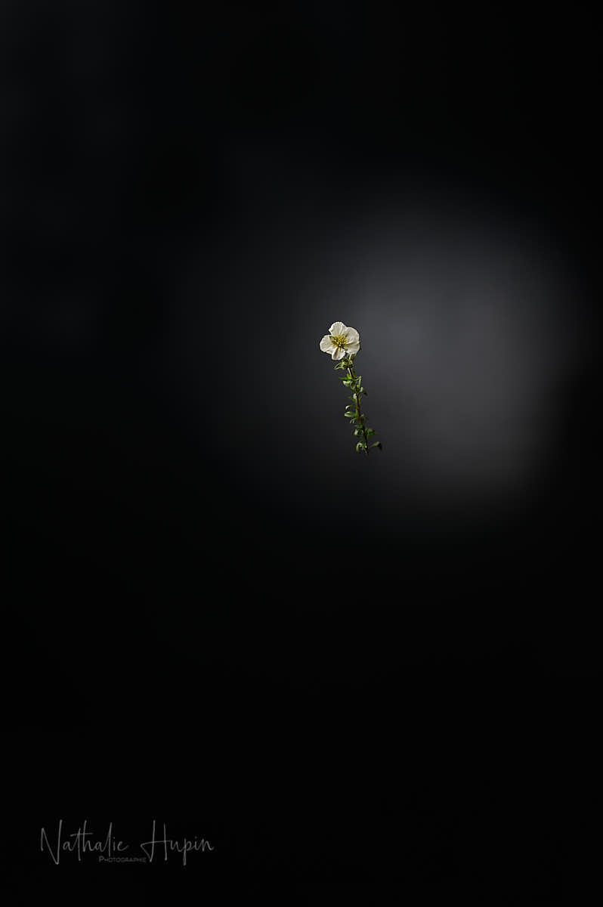

Le 17 avril, c’est la journée internationale des luttes paysannes. Je tiens à apporter mon soutien à tous les agriculteurs qui travaillent dur pour nous fournir à manger. Et pourtant, comme ils sont si souvent malmenés et leur métier si mal reconnu ! Alors que nous leur devons beaucoup, car nous mangeons grâce à eux et à leurs sacrifices. Le journal le Soir a consacré aujourd’hui une de ses pages aux bienfaits du pissenlit, dont j’ai parlé dans le divoc d’hier 😉 Pour ma part, pour aujourd’hui, j’avais prévu une très jolie petite fleur ornementale, l’arenaria montana.

_Une bien jolie fleur, si menue quand elle est isolée, si majestueuse quand elle est avec ses soeurs pour former ces magnifiques couvre-sols. - Photographie par **Nathalie Hupin**_

> Appelée sabline des montagnes, arenaria montana n’est pas typiquement montagnarde

Arenaria montana, la sabline des montagnes, est une plante vivace couvre-sol très florifère appartenant à la famille des Caryophyllacées, tout comme les œillets ou les silènes. Bien qu’appelée sabline des montagnes, elle n’est pas vraiment une plante typiquement montagnarde, puisqu’elle est originaire du sud-ouest de l’Europe, présente en France dans les régions atlantiques aussi bien que dans les Cévennes et les Pyrénées. Par contre, elle mérite bien le nom de sabline parce qu’elle s’y développe le long des chemins sableux. La sabline des montagnes est également une plante couvre-sol ou de rocaille très satisfaisante, car persistante et longuement fleurie. (source : aujardin.info)

> Covid a des avantages : redécouvrir nos agriculteurs et la nature

Pour citer un ami facebook “(…) Grâce à ce Covid, de nombreuses familles confinées (re)découvrent les bienfaits et la joie des produits locaux, des légumes Terre, du lait cru, du fromage au lait cru, des pains artisanaux… le Bio paysan monte en flèche également !(…)” Je vous invite à rendre visite à nos producteurs locaux, il y en a parfois plus que vous ne croyez près de chez vous (j’en ai d’ailleurs découvert de nouveaux, alors que je m’intéressais déjà beaucoup au sujet, bien avant Covid. Ce sont eux qui sont importants dans le fonctionnement de notre économie. Pas des productions qui viennent de l’autre côté de la terre et qui, parfois, sont fabriquées par des personnes qui sont exploitées. Car le prix du bon marché, c’est ça : c’est l’utilisation des plus faibles à outrance. Un conseil : consommez éthique et renseignez-vous sur la provenance de ce que vous achetez, chaque fois que vous le pouvez.

> Astuce du jour : ses fleurs blanches et sa nature de couvre-sol valent aussi à la sabline des montagnes le surnom de corbeille d’argent (déjà attribué à deux autres fleurs que je vous ai présentées précédemment).

> Astuce photo du jour : je suppose que vous avez remarqué que j’essaie de toujours conserver le même cadrage pour toutes les photos de divoc. Ce n’est pas toujours facile, car je photographie à main levée pour cette série. Mais j’essaie de m’y tenir, ainsi, si vous me lisez régulièrement, vous pouvez vous faire une idée des tailles respectives de chaque plante. Pour l’instant, arenaria montana est une des plus petites, avec la pâquerette.
