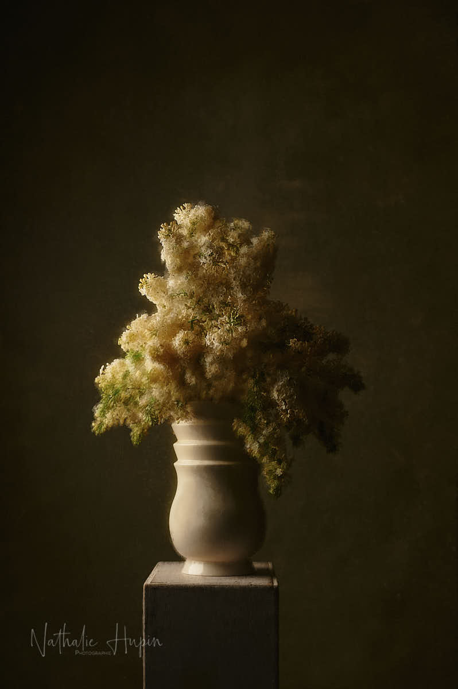

Look hors cadre pour ce dimanche 19 avril 2020.
Bouquet de lilas dans vase Royal Boch, collection Charles Catteau.

_Total look painterly pour ce bouquet de lilas dans un vase Royal Boch Charles Catteau - Photographie par **Nathalie Hupin**_

> Une création Charles Catteau, c’est un peu de patrimoine wallon

Charles Catteau est engagé fin 1906 comme dessinateur (création et peinture de décors) et devient rapidement responsable du département décoration qu’il renommera plus tard Atelier de Fantaisie en 1920. Il deviendra également titulaire du cours de peinture décorative de l’école industrielle supérieure de La Louvière. Il restera chez Boch Frères jusqu’au 8 novembre 1954. On lui doit une production importante de produits Art déco. (source : Wikipedia)

> Le saviez-vous ? Royal Boch était une faïencerie située à La Louvière en Belgique. Fondée en 1841, elle commercialisa sa production sous l’appellation Keramis. Royal Boch représentait l’excellence wallonne. L’unité de production de La Louvière a été fermée en 2011. Un musée a été construit sur le site (http://www.keramis.be/). Avoir une pièce Royal Boch, c’est posséder un peu du Patrimoine wallon.
